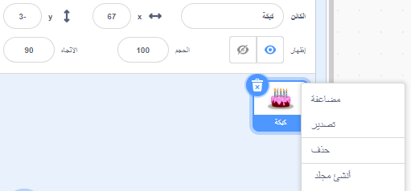
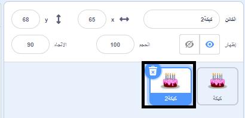
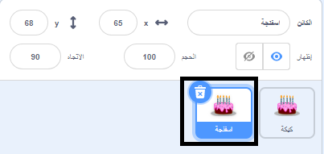

انقر بزر الماوس الأيمن (أو على جهاز لوحي ، انقر مع الاستمرار) على أول كائن في قائمة Sprite أسفل المنصة:

{:width="300px"}

حدد **مكرر**. سيؤدي هذا إلى إنشاء نسخة من الكائن الأول الخاص بك ، مع اللاحقة "2":

{:width="300px"}

إعادة تسمية الكائن:

{:width="300px"}

سيتغير اسم الكائن الخاص بك في قائمة الكائنات:

{:width="300px"}

الكائن الثاني الخاص بك له نفس التعليمات البرمجية للكائن الأول بالضبط. لا تقم بتشغيل البرنامج حتى تبدأ في تغيير التعليمات البرمجية للكائن الثاني - فقد لا ترى الكائن الثاني لأنه قد يكون موضوعًا أسفل الكائن الأول.
