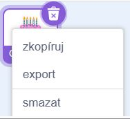
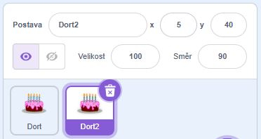
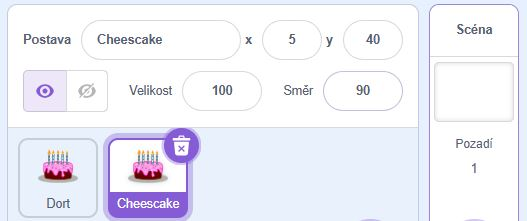
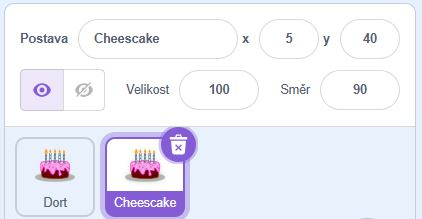

Klikněte pravým tlačítkem (nebo na tabletu klepněte a podržte) na svoji první postavu v seznamu postav pod scénou:

{:width="300px"}

Vyberte **duplikát**. Tímto se vytvoří kopie vašeho prvního sprite s příponou „2“:

{:width="300px"}

Přejmenovat postavu:

{:width="300px"}

Jméno vaší postavy se změní v seznamu sprite:

{:width="300px"}

Váše druhá postav má přesně stejný kód jako první postava. Nespouštějte program, dokud nezačnete měnit kód druhé postavy – druhou postavu možná neuvidíte, protože může být umístěna pod první postavou.
