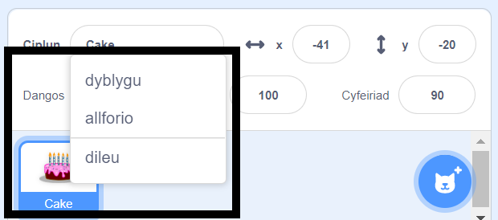
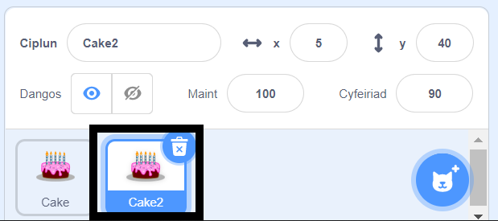
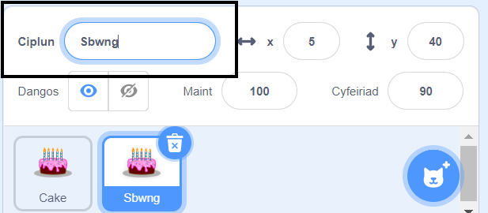
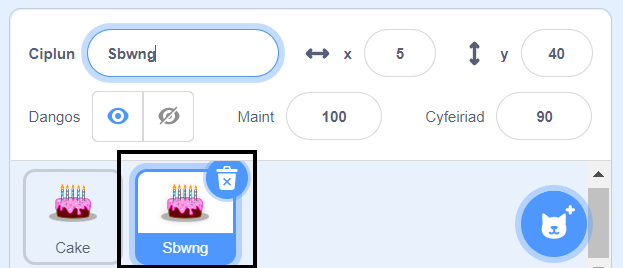

De-glicia (neu ar dabled, taro a dal) dy gorlun cyntaf yn y rhestr Corluniau sydd islaw'r Llwyfan:

{:width="300px"}

Dewisa **dyblygu**. Bydd hyn yn creu copi o dy gorlun cyntaf, gyda'r ôl-ddodiad "2":

{:width="300px"}

Rho enw newydd i dy gorlun:

{:width="300px"}

Bydd enw dy gorlun yn newid yn y rhestr Corluniau:

{:width="300px"}

Mae gan dy ail gorlun yr un cod yn union â dy gorlun cyntaf. Paid â rhedeg y rhaglen nes dy fod wedi dechrau newid cod yr ail gorlun - efallai na weli di'r ail gorlun oherwydd mae'n bosib ei fod o dan y corlun cyntaf.
