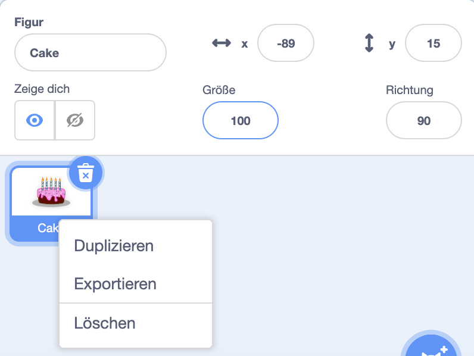
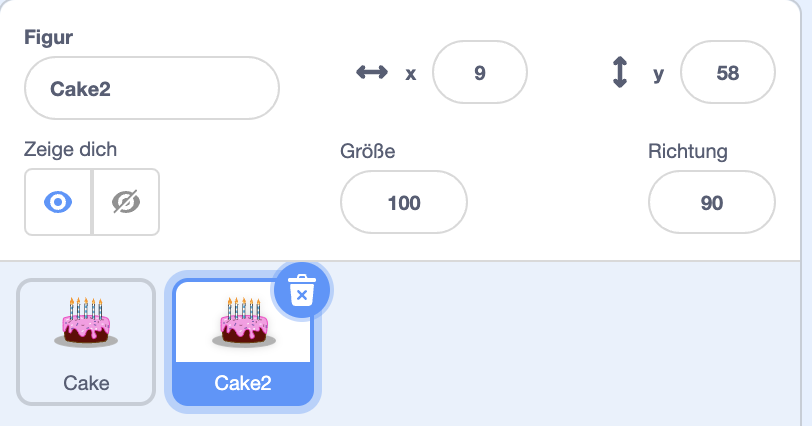
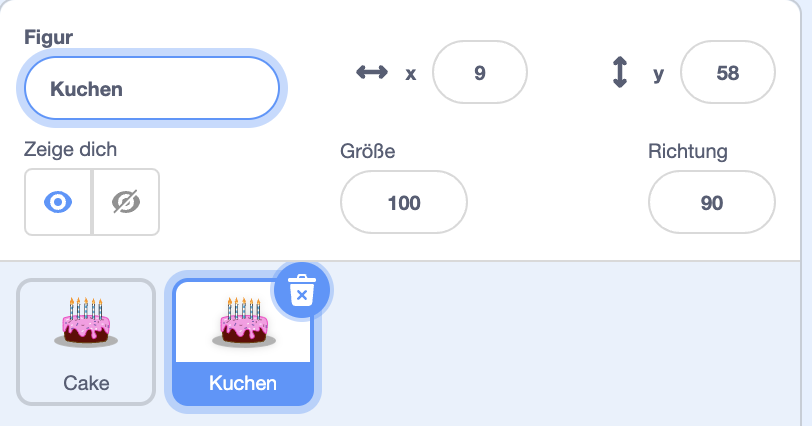
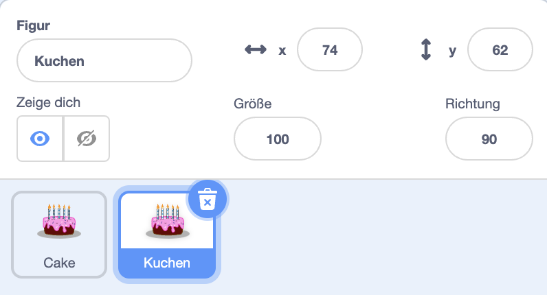

Klicke mit der rechten Maustaste auf deine erste Figur in der Figuren-Liste unter der Bühne (oder auf einem Tablet: tippe und halte die Figur):

{:width="300px"}

Wähle **duplizieren**. Dadurch wird eine Kopie deiner ersten Figur mit dem Suffix „2“ erstellt:

{:width="300px"}

Eine Figur umbenennen:

{:width="300px"}

Der Name deiner Figur ändert sich in der Figuren-Liste:

{:width="300px"}

Deine zweite Figur hat genau denselben Code wie die erste Figur. Führe das Programm erst aus, wenn du begonnen hast, den Code der zweiten Figur zu ändern. Möglicherweise siehst du die zweite Figur nicht, weil es sich unter der ersten Figur befindet.
