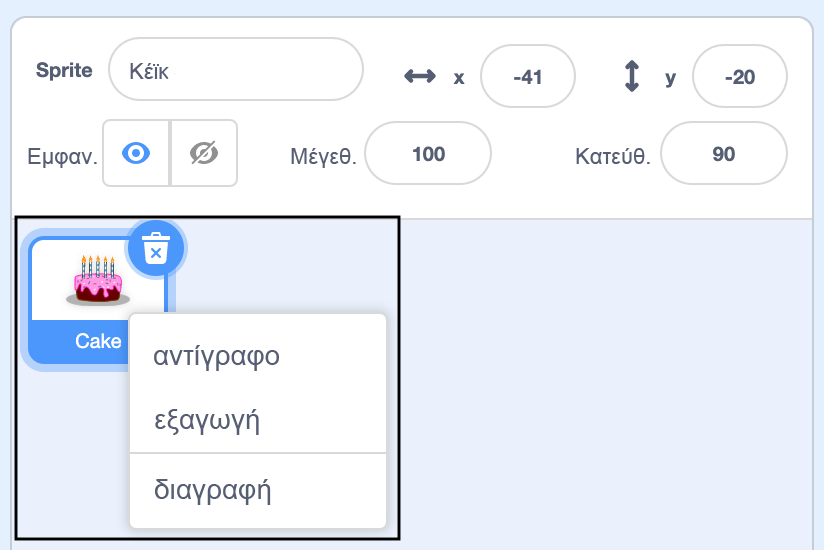
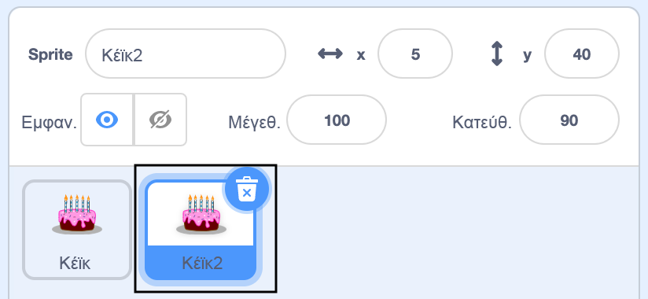
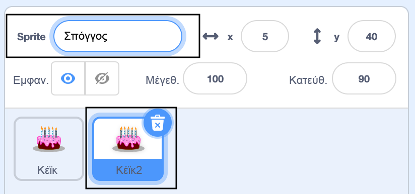

Κάντε δεξί κλικ (ή σε tablet, πατήστε παρατεταμένα) στο πρώτο σας μπλοκ γραφικών στη λίστα μπλοκ γραφικών κάτω από το Stage:

{:width="300px"}

Επιλέξτε **διπλότυπο**. Αυτό θα δημιουργήσει ένα αντίγραφο του πρώτου σας μπλοκ γραφικών, με το επίθημα "2":

{:width="300px"}

Μετονόμασε ένα μπλοκ γραφικών:

{:width="300px"}

Το όνομα του μπλοκ γραφικών σας θα αλλάξει στη λίστα μπλοκ γραφικών:

{:width="300px"}

Το δεύτερο μπλοκ γραφικών σας έχει ακριβώς τον ίδιο κωδικό με το πρώτο μπλοκ γραφικών. Μην εκτελέσετε το πρόγραμμα έως ότου αρχίσετε να αλλάζετε τον κωδικό του δεύτερου μπλοκ γραφικών - μπορεί να μην βλέπετε το δεύτερο μπλοκ γραφικών επειδή μπορεί να βρίσκεται κάτω από το πρώτο.
