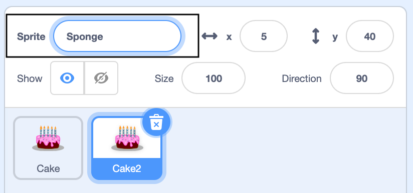

## Duplicate a Sprite in Scratch3

Right-click on your first sprite in the Sprite list below the Stage (or if you are using a tablet, tap and hold):
{:width="300px"}

Select **duplicate**. This will create a copy of your first sprite with the suffix "2":
{:width="300px"}

Rename your sprite:
{:width="300px"}

Your sprite's name will change in the Sprite list:
{:width="300px"}

Your second sprite has exactly the same code as your first sprite. Do not run the program until you have started to change the second sprite's code — you will not see the second sprite because it is positioned underneath the first sprite.
