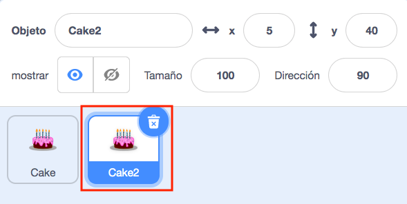
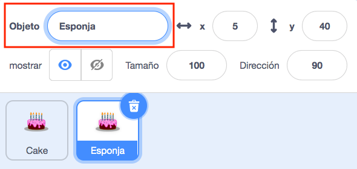
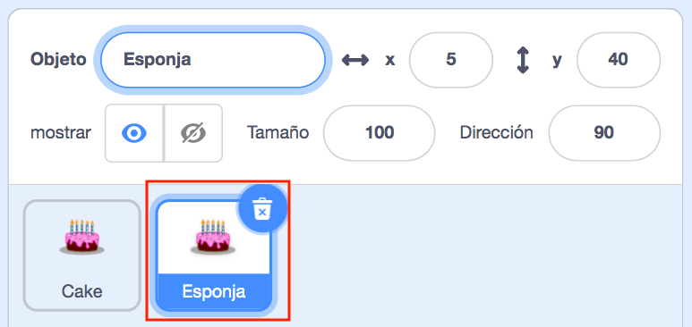

Haz clic con el botón derecho (o en una tableta, mantén apretado) en tu primer objeto en la lista de objetos debajo del escenario:

{:width="300px"}

Selecciona **duplicar**. Esto creará una copia de tu primer objeto, con el sufijo "2":

{:width="300px"}

Renombra tu objeto:

{:width="300px"}

El nombre de tu objeto cambiará en la lista de objetos:

{:width="300px"}

Tu segundo objeto tiene exactamente el mismo código que tu primer objeto. No ejecutes el programa hasta que hayas comenzado a cambiar el código del segundo objeto; es posible que no veas el segundo objeto porque podría estar ubicado debajo del primero.
