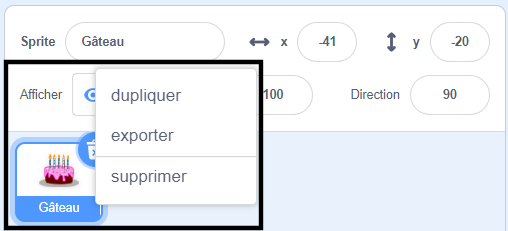
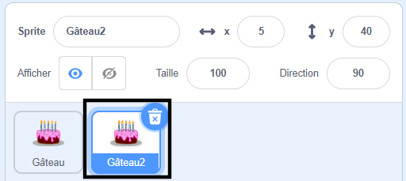
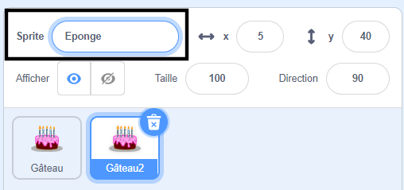
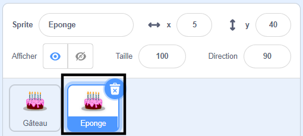

Clique avec le bouton droit de ta souris (ou si tu utilises une tablette, maintiens ton doigt appuyé) sur ton premier sprite dans la liste des sprites sous la scène : {:width="300px"}

Sélectionne **dupliquer**. Cela va créer une copie de ton premier sprite, avec le suffixe "2" : {:width="300px"}

Renomme ton sprite : {:width="300px"}

Le nom de ton sprite changera dans la liste des sprites : {:width="300px"}

Ton deuxième sprite a exactement le même code que ton premier sprite. N'exécute pas le programme tant que tu n'as pas commencé à modifier le code du second sprite - tu risques de ne pas voir le second sprite car il peut être positionné sous le premier sprite.
