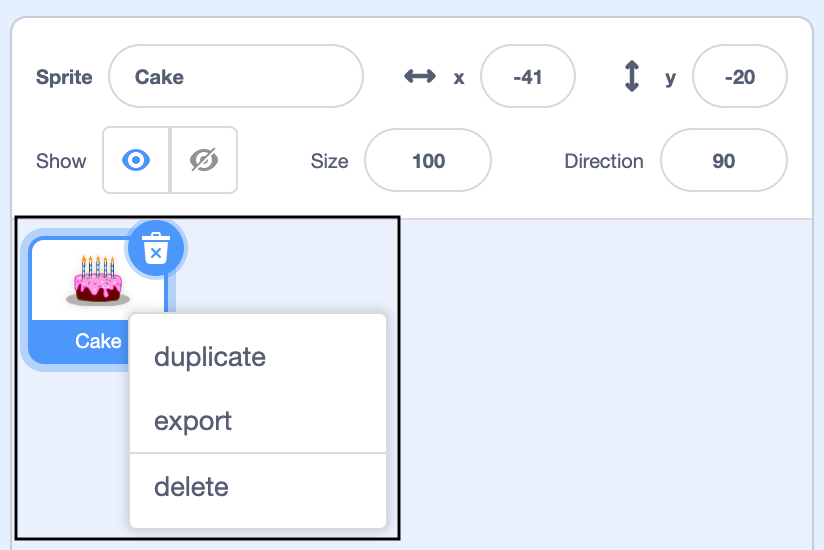
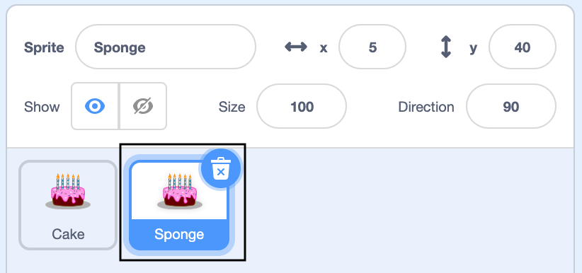

स्टेज के नीचे स्प्राइट सूची में अपने पहले स्प्राइट पर राइट-क्लिक करें (या टैबलेट पर टैप करके रखें):

{:width="300px"}

चुनें**duplicate** (डुप्लिकेट) । यह प्रत्यय "2" के साथ आपके पहले स्प्राइट की एक प्रति बनाएगा:

{:width="300px"}

स्प्राइट का नाम बदलें:

{:width="300px"}

स्प्राइट सूची में आपके स्प्राइट का नाम बदल जाएगा:

{:width="300px"}

आपके दूसरे स्प्राइट का वही कोड है जो आपके पहले स्प्राइट का है। प्रोग्राम को तब तक न चलाएं जब तक आप दूसरे स्प्राइट के कोड को बदलना शुरू नहीं कर देते - हो सकता है कि आपको दूसरा स्प्राइट दिखाई न दे क्योंकि वह पहले स्प्राइट के नीचे स्थित है।
