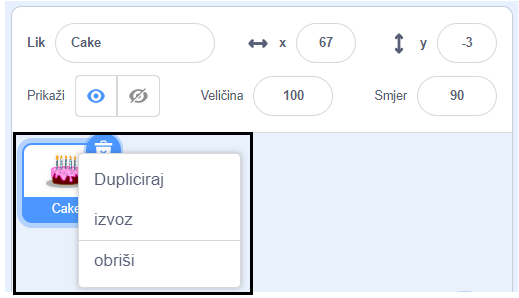
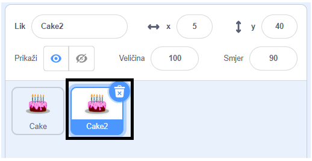
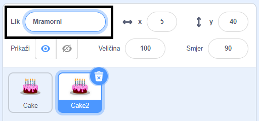
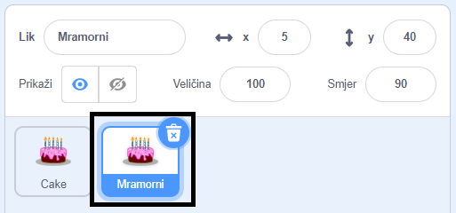

Desnom tipkom miša klikni (ili na tabletu dodirni i drži) na svog prvog lika s popisa likova ispod pozornice:

{:width="300px"}

Odaberi **Dupliciraj**. Ovo će stvoriti kopiju tvog prvog lika, sa sufiksom 2:

{:width="300px"}

Preimenuj lika:

{:width="300px"}

Ime tvog lika će se promijeniti na popisu likova:

{:width="300px"}

Tvoj drugi lik ima potpuno isti kôd kao tvoj prvi lik. Ne pokreći program dok ne počneš mijenjati kôd drugog lika — možda nećeš vidjeti drugi lik jer bi se mogao nalaziti ispod prvog lika.
