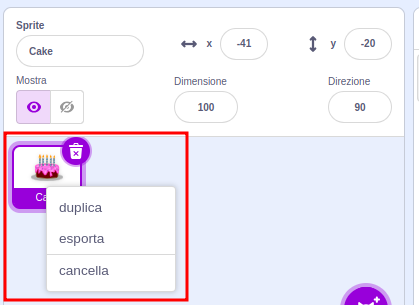
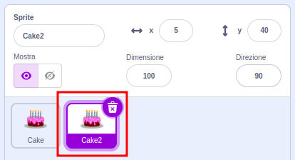
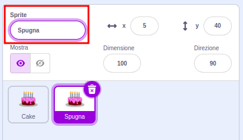
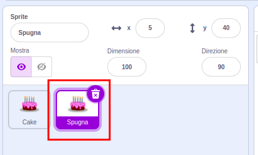

Fai clic con il pulsante destro del mouse (o su un tablet, tocca e tieni premuto) sul tuo primo sprite nell'elenco degli sprite sotto lo Stage:

{:width="300px"}

Seleziona **duplica**. Questo creerà una copia del tuo primo sprite, con il suffisso "2":

{:width="300px"}

Rinomina il tuo sprite:

{:width="300px"}

Il nome del tuo sprite cambierà nell'elenco degli sprite:

{:width="300px"}

Il tuo secondo sprite ha esattamente lo stesso codice del tuo primo sprite. Non eseguire il programma prima di aver modificato il codice del tuo secondo sprite - potresti non vedere alcuna differenza perché il secondo sprite potrebbe essere posizionato sotto il primo.
