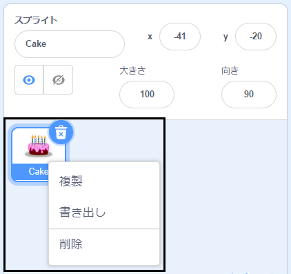

ステージの下のスプライトリストにある最初のスプライトを右クリック（またはタブレットではタップ＆ホールド）します。

{:width="300px"}

**複製**を選択します。 これにより、末尾に「2」が付いた最初のスプライトのコピーが作成されます。

{:width="300px"}

スプライトの名前を変更します。

{:width="300px"}

スプライトの名前がスプライトリストで変更されます。

{:width="300px"}

2番目のスプライトには、最初のスプライトとまったく同じコードがあります。 2番目のスプライトのコードの変更を開始するまでプログラムを実行しないでください。2番目のスプライトは最初のスプライトの下に配置されている可能性があるため、表示されない場合があります。
