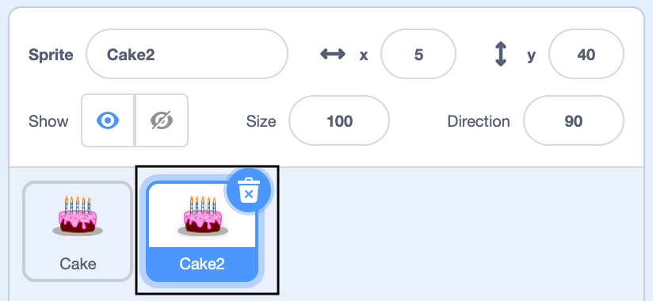

स्टेजच्या खाली असलेल्या स्प्राइट सूचीमध्ये तुमच्या पहिल्या स्प्राइटवर उजवे-क्लिक करा (किंवा टॅबलेटवर, टॅप करा आणि धरून ठेवा):

{:width="300px"}

**नक्कल**निवडा. हे तुमच्या पहिल्या स्प्राईटची प्रत तयार करेल, प्रत्यय "2" सह:

{:width="300px"}

तुमच्या स्प्राइटचे नाव बदला:

{:width="300px"}

स्प्राईट यादीत तुमच्या स्प्राईटचे नाव बदलेल:

{:width="300px"}

तुमच्या दुसऱ्या स्प्राईटमध्ये तुमच्या पहिल्या स्प्राईटसारखाच कोड आहे. जोपर्यंत तुम्ही दुसऱ्या स्प्राईटचा कोड बदलण्यास सुरुवात करत नाही तोपर्यंत कार्यक्रम चालवू नका — तुम्हाला कदाचित दुसरा स्प्राईट दिसणार नाही कारण तो पहिल्या स्प्राइटच्या खाली असू शकतो.
