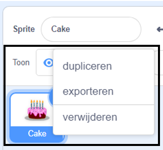
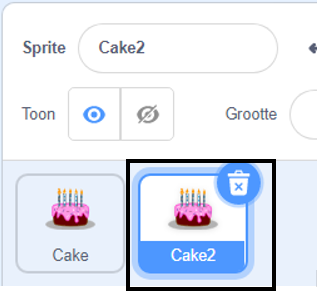
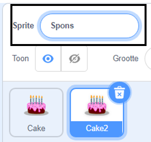
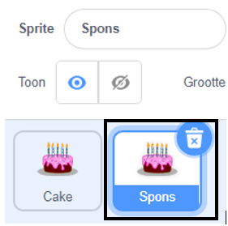

Klik met de rechtermuisknop (of tik op een tablet en houd vast) op je eerste sprite in de Sprite lijst onder het werkgebied:

{:width="300px"}

Klik op **dupliceren**. Dit maakt een kopie van je eerste sprite, met het achtervoegsel "2":

{:width="300px"}

Geef je sprite een nieuwe naam:

{:width="300px"}

De naam van je sprite verandert in de sprite lijst:

{:width="300px"}

Je tweede sprite heeft exact dezelfde code als je eerste sprite. Voer het programma niet uit voordat je bent begonnen met het wijzigen van de code van de tweede sprite - het kan zijn dat je de tweede sprite niet ziet omdat deze zich onder de eerste sprite bevindt.
