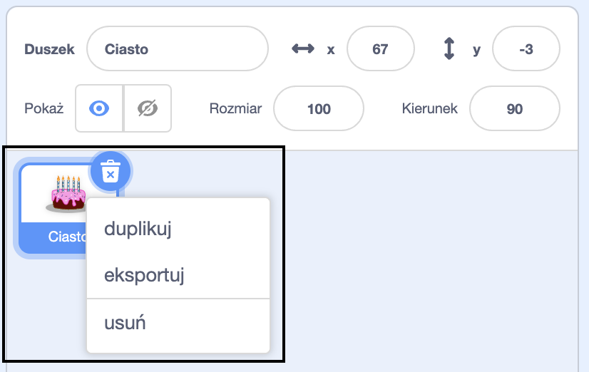
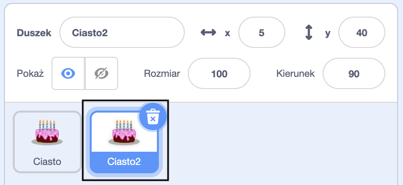
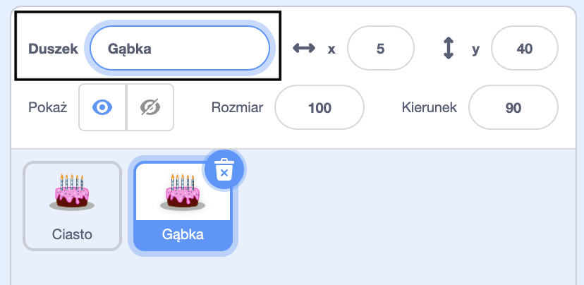
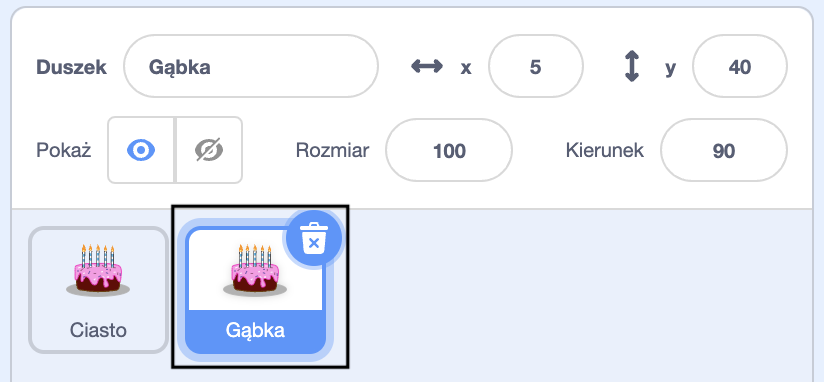

Kliknij prawym przyciskiem myszy (lub na tablecie stuknij i przytrzymaj) swojego pierwszego duszka na liście duszków pod sceną:

{:width="300px"}

Wybierz opcję **duplikuj**. Spowoduje to utworzenie kopii pierwszego duszka z końcówką "2" w nazwie:

{:width="300px"}

Zmień nazwę duszka:

{:width="300px"}

Nazwa twojego duszka zmieni się na liście duszków:

{:width="300px"}

Twój drugi duszek ma dokładnie taki sam kod jak pierwszy. Nie uruchamiaj programu, dopóki nie zaczniesz zmieniać kodu drugiego duszka — możesz nie widzieć drugiego duszka, ponieważ może być umieszczony dokładnie pod pierwszym duszkiem.
