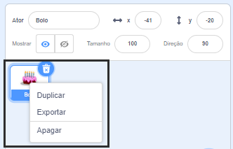
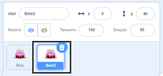
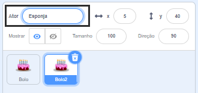
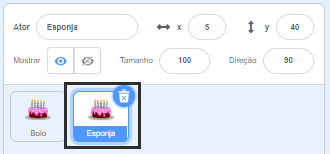

Clique com o botão direito (ou em um tablet, toque e segure) em seu primeiro ator na lista de atores abaixo do Palco:

{:width="300px"}

Selecione **Duplicar**. Isso criará uma cópia do seu primeiro ator, com o sufixo "2":

{:width="300px"}

Renomeie seu ator:

{:width="300px"}

O nome do seu ator mudará na lista de atores:

{:width="300px"}

Seu segundo ator tem exatamente o mesmo código de seu primeiro ator. Não execute seu programa até ter começado a alterar o código do segundo ator — talvez você não verá o segundo ator porque ele poderá estar posicionado por baixo do primeiro.
