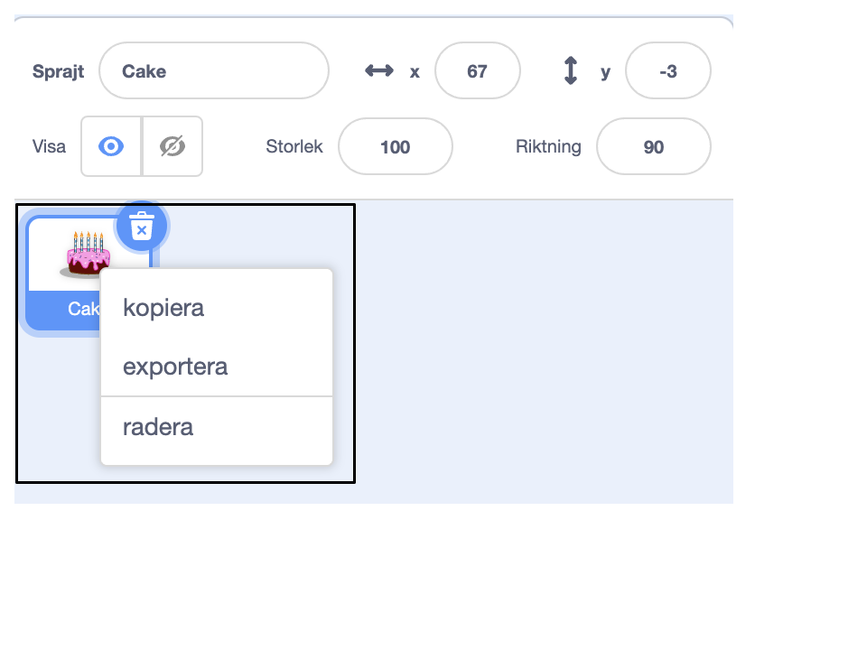
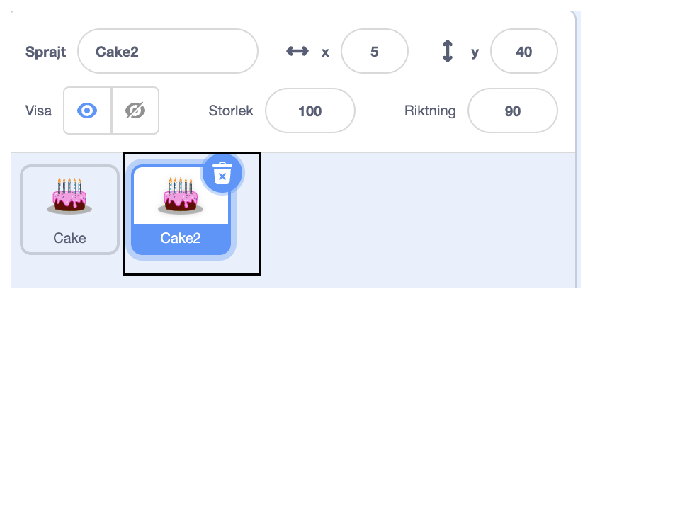

Högerklicka (eller på en surfplatta, tryck och håll kvar) på din första sprajt i sprajtlistan under scenen:

{:width="300px"}

Välj **kopiera**. Detta kommer att skapa en kopia av din första sprajt, med ändelsen "2":

{:width="300px"}

Byt namn på din sprajt:

{:width="300px"}

Din sprajts namn kommer att ändras i sprajtlistan:

{:width="300px"}

Din andra sprajt har exakt samma kod som din första. Kör inte programmet förrän du har börjat ändra den andra sprajten kod – du kanske inte ser den andra sprajten eftersom den kan vara placerad under den första.
