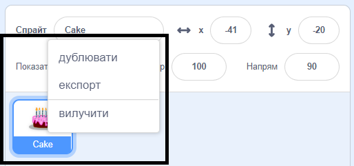
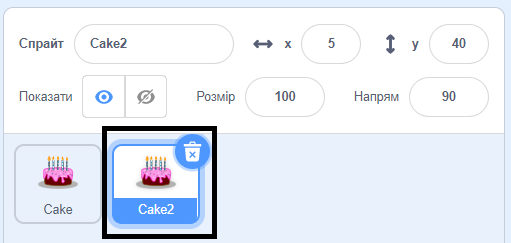
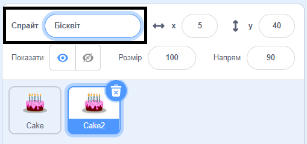
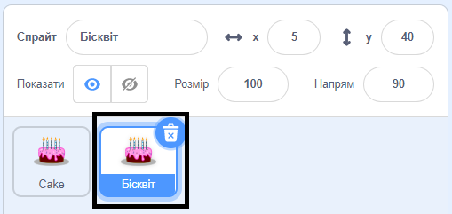

Клацни правою кнопкою миші (або на планшеті тапни і утримуй) по першому спрайту в Списку спрайтів під Сценою:

{:width="300px"}

Вибери **дублювати**. Таким чином буде створена копія твого першого спрайта з суфіксом «2»:

{:width="300px"}

Перейменуй свій спрайт:

{:width="300px"}

Ім'я твого спрайта зміниться у Списку спрайтів:

{:width="300px"}

Твій другий спрайт має точно такий код, як і твій перший спрайт. Не запускай програму, поки не почнеш змінювати код другого спрайту — ти можеш не побачити другий спрайт, тому що він може бути розташований під першим спрайтом.
