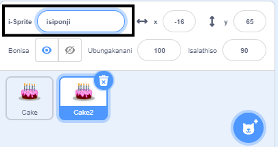

Cofa ekunene (okanye kwithebhulethi, cofa kwaye ubambe) kwisprite sakho sokuqala kuluhlu lweSprite ngaphantsi kweQonga:

{:width="300px"}

Khetha u-**phinda**. Oku kuya kudala isprite sesibini esifana nkqwa nesokuqala, sine simamva "2":

{:width="300px"}

Thiya kwakhona isprite sakho:

{:width="300px"}

Igama lesprite sakho liza kutshintsha kuluhlu lweSprite:

{:width="300px"}

iSprite sakho sesibini sinekhowudi efana nkqwa nesisprite sakho sokuqala. Sukuyidlala inkqubo yekhowudi de ube uqale watshintsha ikhowudi yesprite sesibini — usenokungasiboni isprite sesibini kuba sinokwenzeka ukuba singaphantsi kwesprite sokuqala.
